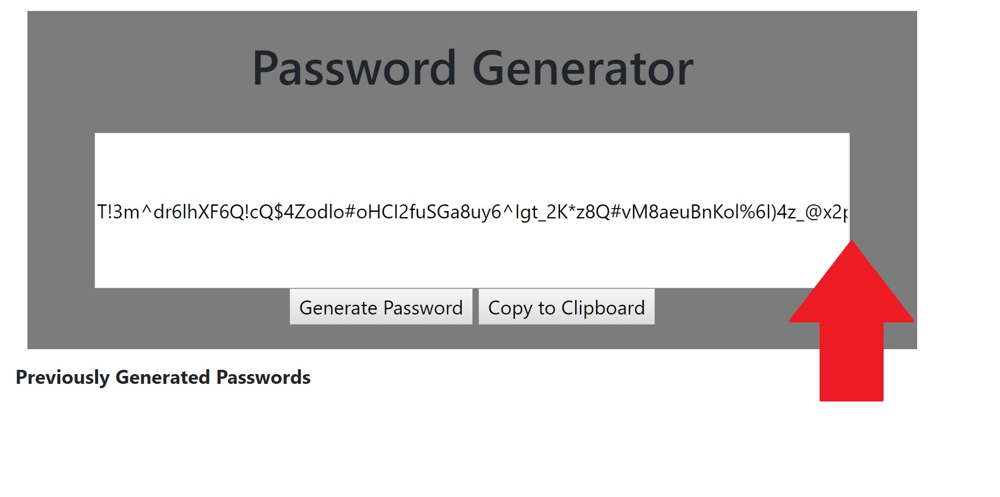

# project title: password-generator
​
The purpose of this project is to create a page using HTML/CSS & Javascript that allows the user to randomly generate a password at the click of a button. This is commonly used by large companies and organizations and can be incredibly helpfull to secure private and sensitive information.
​
## Getting Started
​
I began this project like any other, initially creating the necessary files to provide an organized structure and lay down the foundation. This entailed making a style.css file and an index.html file. I started on the index.html, establishing the initial starter code and adding the basic elements that would be featured on the page. Having previously worked with Bootstrap, i felt there was a lot to be gained with utlizing some of their styling in addition to my own so i proceeded to link both the style.css file along with bootsrap (made availabe in the Getting Started section of their website).

I then created a container which would, for lack of a better word, contain the elements of the password generator including the header, buttons and, of course, the generated password. I also thought to add placeholders in the event that i wished to be more creative and add additonal elements such as an option to influence the length of the password generated or the option to automatically copy it to the user's clipboard.


Avoiding the Javascript aspect of the project as much as possible, i then dove into some styling once i had the basic framework established within the container. The styling was actually quite minimum at first as bootstrap had provided a majority of the customization options i would need leaving only some small alterations to be made in the measurments of the container and spacing within it. I didn't spend too long on styling though as i wanted to take a decent amount of time to consider what i wanted the design to look like. It was then that i started working on the actual coding (in Javascript).


This was very intimidating at first as i couldn't quite see how the password generating would even work so i took things one step at a time starting with creating my variables.
i made the basics: a variable with all characters (letters/symbols) that the password could be comprised of (named chars), a variable to represent the current password being generated (named currentPW) and an array to contain all passwords previously generated (in the event that the user may want to access that information) named previousPW.

knowing that the passwords would have to be generated at random, i started working on a 4th variable called charLength which i figured would amount to a randomly generated number within each iteration of a loop (generated with every click of the button to cycle through the character variable, adding each element to the current password variable mentioned earlier). I noticed as i had been creating these variables, the process by which the password generator would work began to make more and more sense to me. After these were made (with the help of Google for the charLength variable), i stepped away from the project in order to get a better idea of how i wanted everything to work and how i'd make it work once i knew what i wanted.

in Ruby (my only previous experience in coding) the variable charLength could be used in a loop utilizing the .times method. The randomly generated number within charLength would control the number of iterations in the loop, each of which would entail adding a random number from the characters variable into the current password variable. at the end of the loop, the page would then display in the space provided (within the container text box) and then store it into the previousPW array (which would initially be empty; previousPW = []).

I was sure to write down hundreds of comments and notes within the page psudo coding out what my approach was going to be so that, by the time i was ready to begin the actual coding of everything, i already knew what i was going to write...with some syntax questions here and there, of course. A massive challenge i encountered, however, was with the loop to generate the random currentPW. Having looked up how Math.floor((Math.Random())) works for the charLength variable gave me some insight but it was a lot of trial and error. At one point i even broke out a whiteboard to work through it (a little tip suggested to me by a friend who is currently attending the AppAcademy bootcamp program).

    Much of the practice involved removing complex elements within the loop and replacing them with simple numbers or characters (such as the charLength variable which i replaced just with the number 10). Foolishly, once i finally figured out the loop, i struggled greatly to get it to run within the text box display i made within the container. This also required some googling and altering the HTML button from type="button" to onclick="myFunction()" along with a line of code following the loop using document.getElementById("password").value = currentPW; (this, i must admit, had to be copied almost directly from w3schools.com but i did my best to understand each part of the code rather than just pasting it and calling it a day). Once the button and display started to function properly, i encountered more issues with the loop that required only minor tweeks and changes such as adding a multiplication of the Math.random by Math.floor within the outside Math.floor indexing the chars variable. I may be failing to explain that in proper terminology but that's ultimately what i ended up doing (which took a bit of time, testing and googling to reach). After everything, i loaded up the browser and and the password generator functioned beautifully! not going to lie, i litterally cheered! Celebrated with a little sugary bag of mini-bites and a new episode of The Mandalorian on Disney + before diving back in.

Picking up after completing the random password generator, i quickly found that there were some display issues with the text box as passwords with a higher length were cutting out of the box's set width which required some more googling to better frame the text itself. I also wanted to work on the copt to clipboard feature (which would become significantly more important if i couldn't fix the text issue).


* Design Change:
rather than generating a random character length (charLength), i've created a prompt asking the user for the desired character length of their generated password along with alerts (conditionals based on what is input by the user) should they input a number less than 8 or write a letter/word rather than a number.




After changing to the prompt option i then decided to add some more creative changes to the style and background, selecting and then customizing an image to fit followed by matching the container background-color. I also changed the prompt and alert text to theme it with the background image which was now a cute figure (named Safety Cat) sipping coffee. Added a little blue speech bubble too for extra kicks and to also match the buttons i previously changed with bootstrap to highlight a particular blue when hovered on. Due to Bootstrap's limited color choices, i figured adding elements to the background image would be easier than rewriting the button code so i used google chrom's browser Eye Dropper to determine the color and style the image accordingly.


​
### Prerequisites
​
What things you need to install the software and how to install them
​
```
Give examples
```
​
### Installing
​
A step by step series of examples that tell you how to get a development env running
​
Say what the step will be
​
```
Give the example
```
​
And repeat
​
```
until finished
```
​
End with an example of getting some data out of the system or using it for a little demo
​
​
## Built With
​
* [HTML](https://developer.mozilla.org/en-US/docs/Web/HTML)
* [CSS](https://developer.mozilla.org/en-US/docs/Web/CSS)
* [Javascript](https://developer.mozilla.org/en-US/docs/Web/JavaScript)
​
## Deployed Link
​
* [See Live Site](#)
​
​
## Authors
​
* **YOUR NAME** 
​
- [Link to Portfolio Site](#)
- [Link to Github](https://github.com/)
- [Link to LinkedIn](https://www.linkedin.com/)
​
See also the list of [contributors](https://github.com/your/project/contributors) who participated in this project.
​
## License
​
This project is licensed under the MIT License 
​
## Acknowledgments
​
* Hat tip to anyone whose code, libraries, packages, or UI was used  / inspired from
* Inspiration
* etc